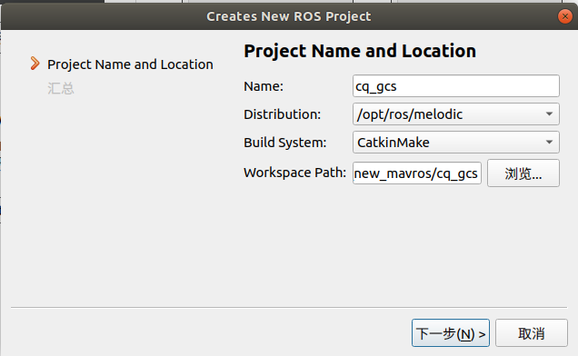

### GCS 地面站 

[cluster 地面站](https://github.com/BearBoy233/cluster_gcs)

[cluster 集群飞机端](https://github.com/BearBoy233/cluster)

串口通信硬件 Microhard P900 (配置为 Mesh 模式)

## quick setup

roslaunch map_widget gcs_map.launch

基于 Qt5 ROS plugis 设计
Qt Creator 4.9.2
Based on Qt 5.12.4(QGC 7.4.0)

opencv 3 (理论上4也行)

--- ---
### 程序包说明

map_widget		地面站 程序

offline_bmap		Html 离线版 百度地图页面

offline_tiles		存放 离线的地图瓦片包

[奶牛快传-bit-202209](https://cowtransfer.com/s/a9aef19af4904c)  *cowtransfer.com 传输口令 u68gzm*

win_offline_tiles	WIN下，下载百度地图离线瓦片地图

--- ---
## 新环境下使用本包

1. 文件->新建文件或项目.
	选择 (项目->其他项目/ ROS Workspace)

2. 选择和输入 Ros Project 名称.
   - `Name`: your_workspace_name
   - `WorkSpace Path`: ~/your_workspace_name
   

3. 将地面站相关 package 放到 ~/your_workspace_name/src 内.

4. 随后可使用 Qt 设计 Ui界面、编译和运行.

5. 之后使用, 用Qt打开 `your_workspace_name.workspace` 文件。

## 依赖

sudo apt install qtpositioning5-dev libqt5sensors5-dev qtmultimedia5-dev

sudo apt install qtwebengine5-dev libqt5webview5-dev