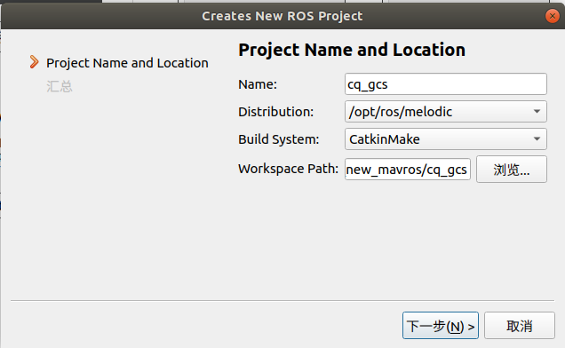

### GCS 地面站 

必须放在 cq_gcs/src 文件里 catkin_make 编译

基于 Qt5 ROS plugis 设计
Qt Creator 4.9.2
Based on Qt 5.12.4(QGC 7.4.0)

--- ---
### 程序包说明

map_widget		地面站 程序

offline_bmap		Html 离线版 百度地图页面

offline_tiles		存放 离线的地图瓦片包

WIn_瓦片地图下载	windows环境下，下载离线瓦片地图

--- ---
# 新环境下使用本包

1. 文件->新建文件或项目.
	选择 (项目->其他项目/ ROS Workspace)

2. 选择和输入 Ros Project 名称.
   - `Name`: cq_gcs
   - `WorkSpace Path`: ~/cq_gcs
   

3. 将地面站相关 package 放到 ~/cq_gcs/src 内.

4. 随后可使用 Qt 设计 Ui界面、编译和运行.

5. 之后使用, 用Qt打开 `cq_gcs.workspace` 文件。
